A common technique used in software development is the use of [feature toggles](https://martinfowler.com/articles/feature-toggles.html), or **feature flags**. These tools help us to accomplish continuous integration, delivery, and release on demand. They're valuable in mitigating the risks associated with introducing changes, allowing us to continuously integrate and deploy with confidence.

**What about in the world of data engineering?** In this realm, too, feature flags can be quite handy! We can utilize them in our data pipelines to make changes to data ingestion, loading, and transformation processes fearlessly. If you're using Azure Synapse Analytics, this translates to integrating feature flags directly into your data pipelines and notebooks.

So, how can we do this? There are many approaches, but in this guide, we'll focus on a solution using Microsoft's managed service offering, **[Azure App Configuration](https://azure.microsoft.com/en-us/products/app-configuration)**. This tool offers centralized application settings and feature flag management, providing a convenient way to modify our data systems' behavior at runtime.

So let's dive right into it!

## Table of Contents
- [Overview](#overview)
- [Prerequisites](#prerequisites)
- [Creating an Azure App Configuration Store](#creating-an-azure-app-configuration-store)
- [Integrating Azure App Configuration into Synapse Pipelines](#integrating-azure-app-configuration-into-synapse-pipelines)
  - [Setup](#setup)
  - [Trying It Out](#trying-it-out)
- [Integrating Azure App Configuration into Synapse Notebooks](#integrating-azure-app-configuration-into-synapse-notebooks)
  - [Setup](#setup-1)
  - [Trying It Out](#trying-it-out-1)
- [Conclusion](#conclusion)

## Overview
This post is divided into sections, guiding you on how to:

1. **Create an Azure App Configuration store.**
2. **Integrate Azure App Configuration into Synapse pipelines.**
3. **Integrate Azure App Configuration into Synapse (PySpark) notebooks.**

Before starting, make sure you have all the prerequisites mentioned in the section below.

**Bonus**: I have also provided a GitHub repository with a ready-to-use utility pipeline and notebook. Check it out at **[bijancamp/synapse-feature-flagging](https://github.com/bijancamp/synapse-feature-flagging)**. With these resources, you'll be all set to integrate Azure App Configuration into your data engineering workflows.

## Prerequisites
To securely integrate Azure App Configuration with Synapse, you will need:
- A **resource group** and **Synapse workspace**.
- **Owner on the resource group**.
- **Synapse Administrator** on the Synapse workspace. Alternatively, you can have **Synapse Contributor** (for pipeline and notebook integration) and **Synapse Credential User** (for notebook integration).
- **Ability to create service principals** in Azure AD (for notebook integration).
- The **Microsoft.AppConfiguration** resource provider registered in your target subscription.
- **Az PowerShell** (either installed locally or via Azure Cloud Shell).

## Creating an Azure App Configuration Store
With your target subscription active in PowerShell, start by creating an instance of Azure App Configuration, also called an "App Configuration store":
```ps
New-AzAppConfigurationStore `
-Name <store-name> `
-ResourceGroupName <resource-group-name> `
-Location <location> `
-Sku Free
```

**Note**: In Production, you'll want to use the `Standard` sku if you have availability requirements or other needs.

You should now have a provisioned App Configuration store:

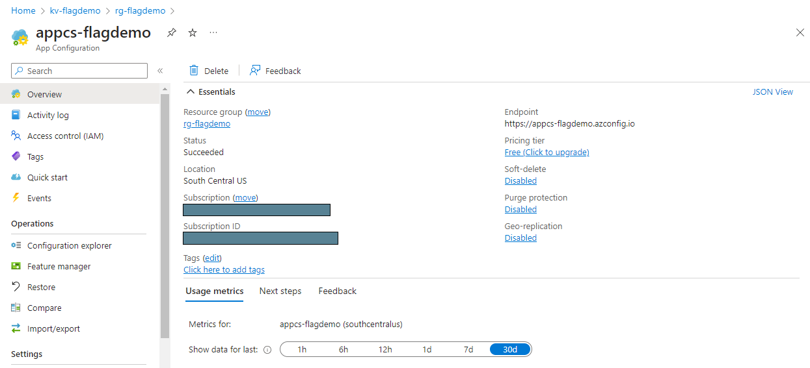

To create and manage feature flags, you need the role of **App Configuration Data Reader** on the configuration store:
```ps
New-AzRoleAssignment `
-ObjectId (Get-AzADUser -SignedIn).Id `
-RoleDefinitionName "App Configuration Data Owner" `
-Scope (Get-AzResource -Name <store-name> -ResourceGroupName <resource-group-name>).ResourceId
```

To enable Synapse to access feature flags via pipelines, grant its managed identity **App Configuration Data Reader**:
```ps
New-AzRoleAssignment `
-ObjectId (Get-AzADServicePrincipal -DisplayName <synapse-workspace-name>).Id `
-RoleDefinitionName "App Configuration Data Reader" `
-Scope (Get-AzResource -Name <store-name> -ResourceGroupName <resource-group-name>).ResourceId
```

It can take up to 15 minutes for your user's role assignment to sync, but once it does, you should be able to go to **Operations > Feature manager** on the App Configuration resource and see the following:

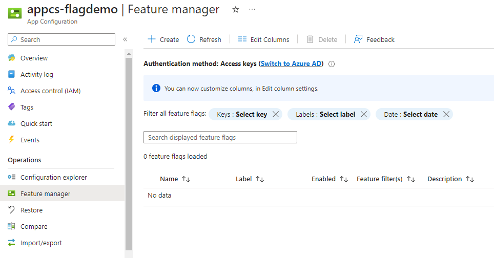

On this page, select "Create" and populate the resulting form with the following values:
| Setting             | Value                       |
| ------------------- | --------------------------- |
| Enable feature flag | Box is **not** checked.     |
| Feature flag name   | **cool-new-feature**        |

Make sure to use **cool-new-feature** for the name since that will be the name used in the sample pipeline and notebook.

Your feature manager page should now look like the following:

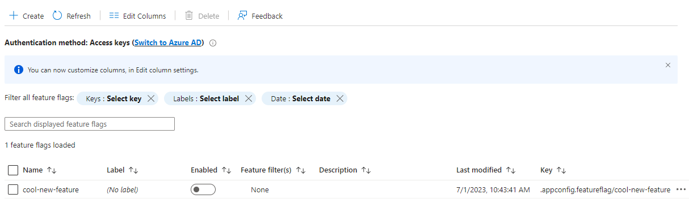

## Integrating Azure App Configuration into Synapse Pipelines
### Setup
With our configuration store and **cool-new-feature** in place, we can proceed to create a Synapse pipeline that calls our App Configuration store. In Synapse Studio, create a new blank pipeline called **GetFeatureFlag**, and click the button in the upper-right corner to open the JSON editor:

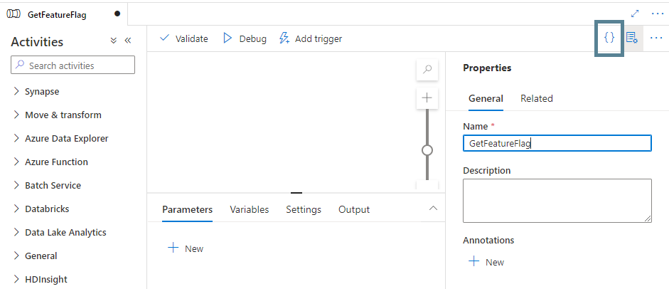

Copy the JSON code from the following file in the GitHub repository into the JSON editor window: [bijancamp/synapse-feature-flagging/pipelines/GetFeatureFlag.json](https://raw.githubusercontent.com/bijancamp/synapse-feature-flagging/main/pipelines/GetFeatureFlag.json). In the copied JSON, replace `<store-name>` in the `parameters` section with the name of your App Configuration store and click "OK":

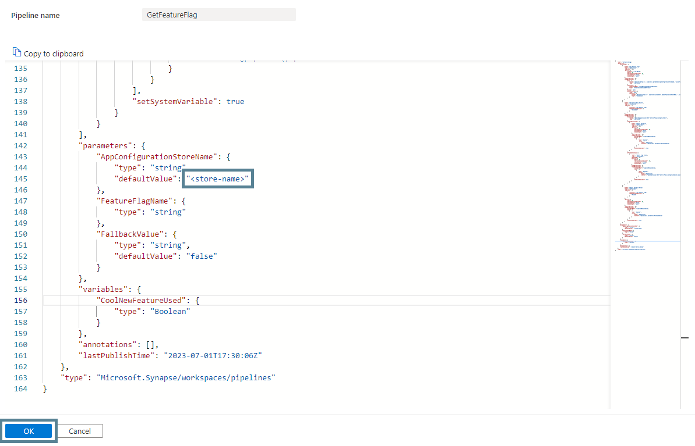

The **GetFeatureFlag** pipeline retrieves information about the feature flag specified via the `FeatureFlagName` parameter. It uses a Web activity and the Synapse managed identity to access the feature flag via the store's endpoint. It also returns a customizable fallback value in case the call to the store fails or the feature flag does not exist. This is similar to the fallback value in LaunchDarkly (a popular third-party service for implementing feature flags).

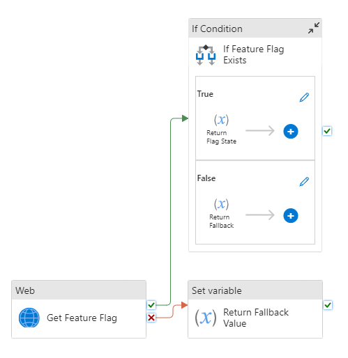

Create another pipeline called **UseFeatureFlag**, and copy the JSON from the following file into its JSON editor: [bijancamp/synapse-feature-flagging/pipelines/UseFeatureFlag.json](https://raw.githubusercontent.com/bijancamp/synapse-feature-flagging/main/pipelines/UseFeatureFlag.json).

This pipeline uses the **GetFeatureFlag** pipeline to look up the value of the **cool-new-feature** flag. If the flag is "enabled", it executes an experimental branch of pipeline activities (i.e., runs an activity called "Used cool-new-feature"); otherwise, it executes the old logic of the pipeline (i.e., runs an activity called "Did Not Use cool-new-feature").

### Trying It Out
Now, let's see it in action! In Synapse Studio, debug the **UseFeatureFlag** pipeline. It should succeed and execute the "Did Not Use cool-new-feature" activity:

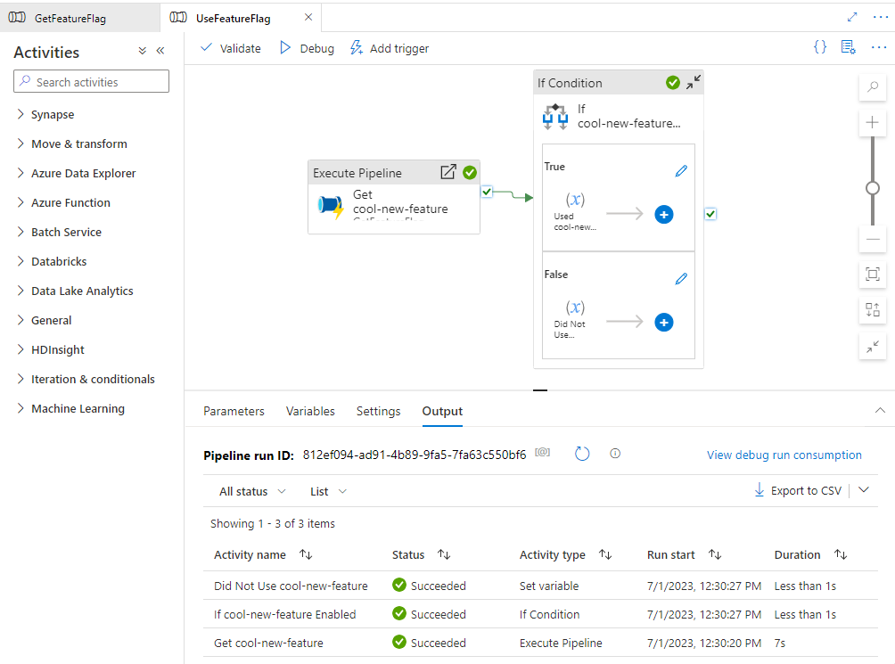

Now go back to the App Configuration resource in the portal, go to **Operations > Feature manager**, and enable the **cool-new-feature** flag:

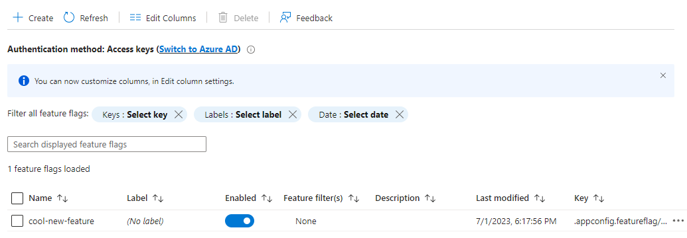

Now debug the **UseFeatureFlag** pipeline again in SynapseStudio. This time, the pipeline executes the "Used cool-new-feature" activity:

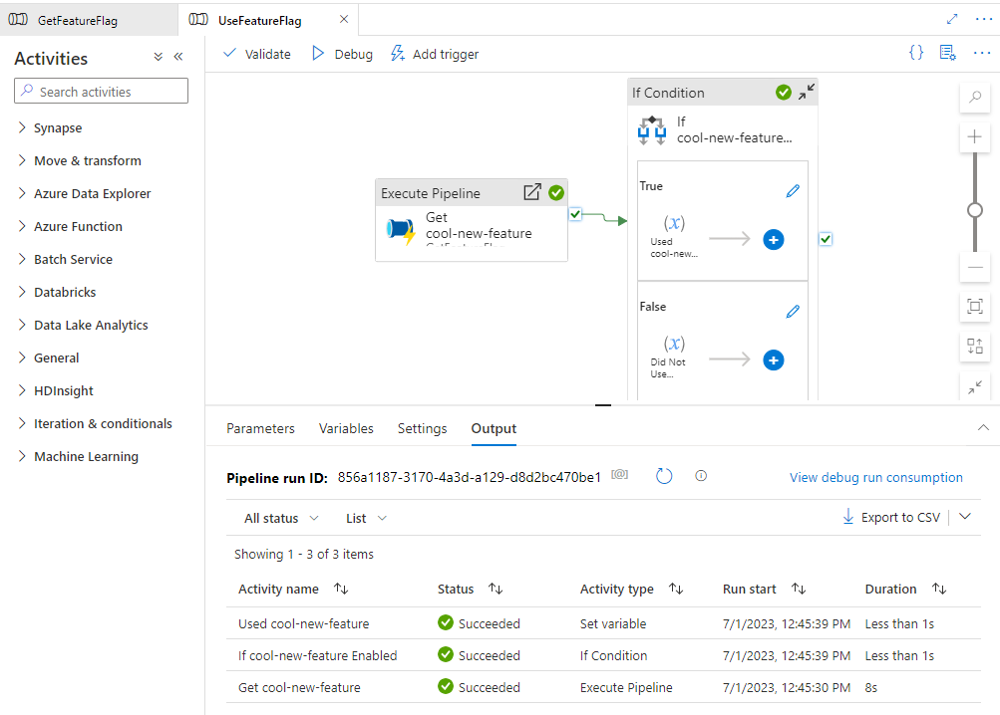

The pipeline has changed its runtime behavior based on an easily adjustable flag! If this pipeline was based on an existing one, you could now confidently promote this version across all your environments, knowing that the risk of breaking the existing pipeline is minimal.

## Integrating Azure App Configuration into Synapse Notebooks
### Setup
In this section, you will integrate Azure App Configuration with Synapse notebooks.

With your configuration store and **cool-new-feature** already set up, let's start by creating a Spark pool:
```ps
New-AzSynapseSparkPool `
-WorkspaceName <synapse-workspace-name> `
-Name <pool-name> `
-NodeCount 3 `
-SparkVersion 3.3 `
-NodeSize Small `
-EnableAutoPause `
-AutoPauseDelayInMinute 15
```

Feel free to adjust the Spark version if there is a later one that you would like to try.

You will use the [azure-identity](https://pypi.org/project/azure-identity/) and [azure-appconfiguration](https://pypi.org/project/azure-appconfiguration/) packages to call the app configuration store from a PySpark notebook, so create a "requirements.txt" file:
```plaintext
azure-identity==1.13.0
azure-appconfiguration==1.4.0
```

The above requirements file pins the latest versions of the packages at the time of this writing, but feel free to try any newer versions that might be available.

Now upload the requirements file to the pool to install the packages:
```ps
Update-AzSynapseSparkPool `
-WorkspaceName <synapse-workspace-name> `
-Name <pool-name> `
-LibraryRequirementsFilePath <path-to-requirements-file>
```

It can take over 20 minutes for the above command to complete.

In the meantime, a service principal is needed for the Spark pool to access the feature flag within the configuration store. Before creating a service principal though, create a key vault to store its client secret and other information:

```ps
New-AzKeyVault `
-Name <vault-name> `
-ResourceGroupName <resource-group-name> `
-Location <location> `
-EnableRbacAuthorization
```

To add secrets to the key vault, grant yourself **Key Vault Secrets Officer**:
```ps
New-AzRoleAssignment `
-ObjectId (Get-AzADUser -SignedIn).Id `
-RoleDefinitionName "Key Vault Secrets Officer" `
-Scope (Get-AzResource -Name <vault-name> -ResourceGroupName <resource-group-name>).ResourceId
```

Also, the Synapse managed identity needs **Key Vault Secrets User** in order for the Spark pool to be able to retrieve secrets:
```ps
New-AzRoleAssignment `
-ObjectId (Get-AzADServicePrincipal -DisplayName <synapse-workspace-name>).Id `
-RoleDefinitionName "Key Vault Secrets User" `
-Scope (Get-AzResource -Name <vault-name> -ResourceGroupName <resource-group-name>).ResourceId
```

In Synapse Studio, add a linked service for the key vault. Use **System Assigned Managed Identity** for the authentication method.

Now, create the service principal for the Spark pool:
```ps
$sp = New-AzADServicePrincipal -DisplayName <service-principal-name>
```

Convert the values we need to secure strings:
```ps
$tenantId = ConvertTo-SecureString (Get-AzContext).Tenant.Id -AsPlainText -Force
$clientId = ConvertTo-SecureString $sp.AppId -AsPlainText -Force
$clientSecret = ConvertTo-SecureString $sp.PasswordCredentials.SecretText -AsPlainText -Force
```

And create the following secrets in the key vault:
```ps
Set-AzKeyVaultSecret -VaultName "<vault-name>" -Name "azure-tenant-id" -SecretValue $tenantId
Set-AzKeyVaultSecret -VaultName "<vault-name>" -Name "synw-notebook-sp-client-id" -SecretValue $clientId
Set-AzKeyVaultSecret -VaultName "<vault-name>" -Name "synw-notebook-sp-client-secret" -SecretValue $clientSecret
```

For the new service principal to be able to retrieve feature flags from the store, grant it **App Configuration Data Reader** on the store:
```ps
New-AzRoleAssignment `
-ObjectId (Get-AzADServicePrincipal -DisplayName <service-principal-name>).Id `
-RoleDefinitionName "App Configuration Data Reader" `
-Scope (Get-AzResource -Name <store-name> -ResourceGroupName <resource-group-name>).ResourceId
```

With the above completed (and once the Spark pool has finished installing the packages from the requirements file) we should now have all the infrastructure and access in place for the pool to communicate with the configuration store.

Now, download the utility and sample notebooks for querying your feature flag store:
- [bijancamp/synapse-feature-flagging/notebooks/GetFeatureFlag.ipynb](https://raw.githubusercontent.com/bijancamp/synapse-feature-flagging/main/notebooks/GetFeatureFlag.ipynb)
- [bijancamp/synapse-feature-flagging/notebooks/UseFeatureFlag.ipynb](https://raw.githubusercontent.com/bijancamp/synapse-feature-flagging/main/notebooks/UseFeatureFlag.ipynb)

In Synapse Studio, import these notebooks by going to the Develop Hub and clicking the "+" button and then "Import":

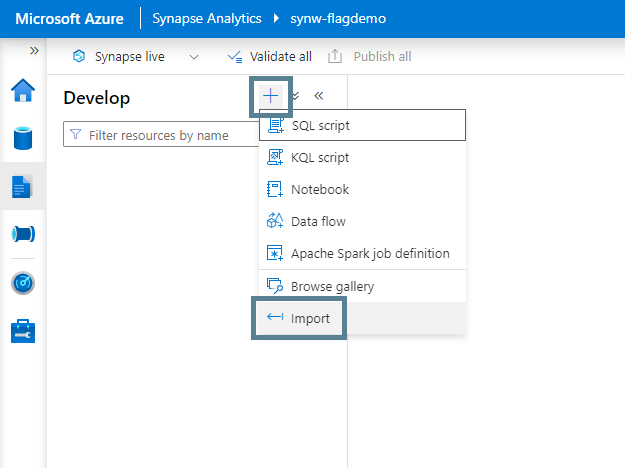

With both notebooks imported, open the **GetFeatureFlag** notebook and replace `<store-name>`, `<vault-name>`, and `<vault-linked-service-name>` in the parameters cell with the names of your resources, and then publish the notebooks.

These notebooks are similar in design to the pipelines. The **GetFeatureFlag** notebook uses Microsoft Spark Utilities (MSSparkUtils) to retrieve the key vault secrets, `ClientSecretCredential` to create an object out of the secrets, and `AzureAppConfigurationClient` to retrieve the feature flag from the store. Like the pipeline, it returns a fallback value if an exception occurs when calling the store.

The **UseFeatureFlag** notebook calls the **GetFeatureFlag** notebook, passing in a value of **cool-new-feature** for the `featureflag` parameter.

### Trying It Out
Back in your App Configuration resource, disable the feature flag.

Now in the **UseFeatureFlag** notebook in Synapse Studio, attach your Spark pool and click the "Run all" button. After it runs, it should display "Cool new feature not used":

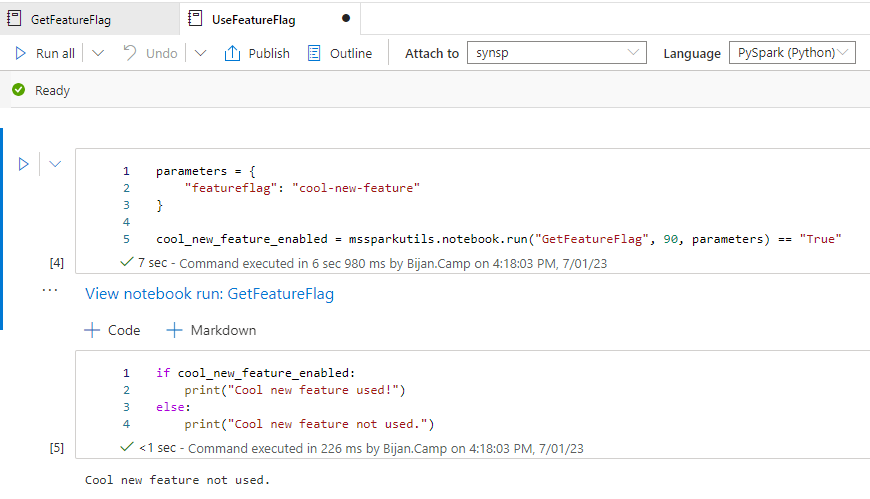

Now enable the feature flag and run the notebook again. This time, it will print "Cool new feature used":

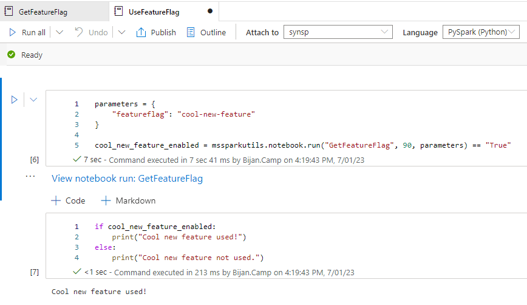

## Conclusion
And there you have it! You have successfully utilized feature flags in Synapse without having to build your own feature management solution or rely on a non-Azure service. With this methodology, you can roll out and roll back features with greater control and ease.

Given that there are a multitude of ways to implement feature flags, how have you implemented feature flags in your Azure data analytics solutions? What challenges did you face and how did you overcome them? Share your thoughts and learnings in the comments below!

Happy continuous integration and deployment! 🚀
