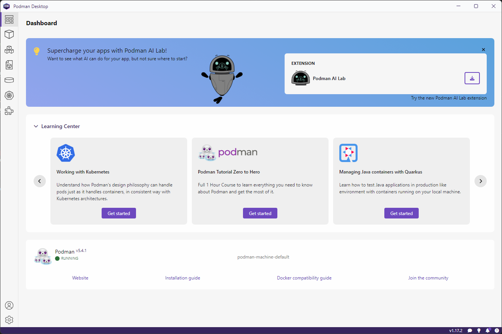
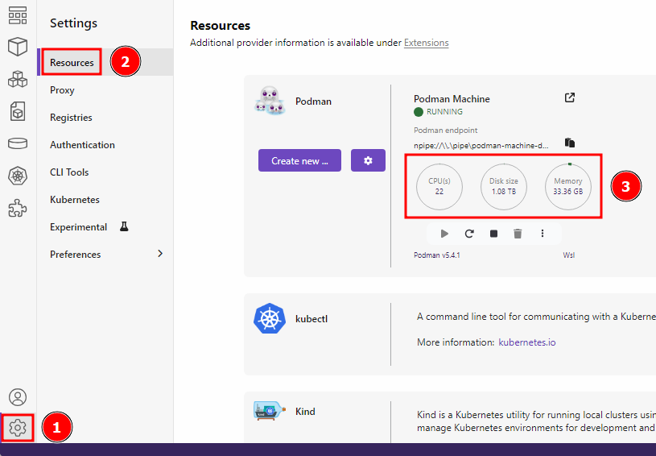
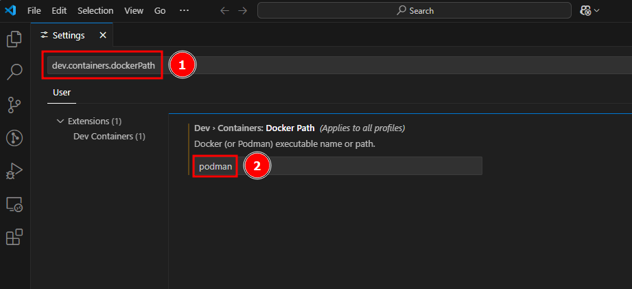
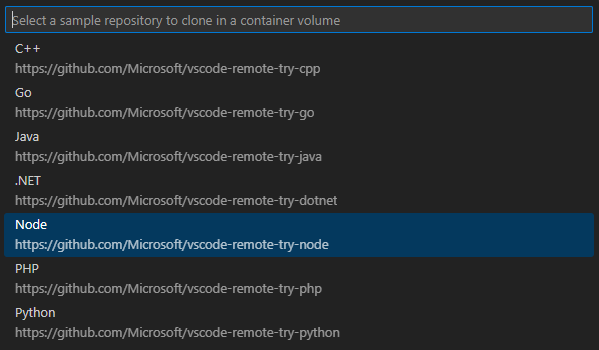
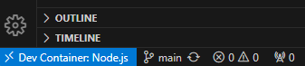

My friend and team lead at [QSC](https://www.qsc.com/) told me that he was
considering switching from Docker to Podman on his Windows host. I had never
used Podman before, but I was interested in trying it out with dev containers in
Visual Studio Code and seeing if it was maybe something we could use going
forward.

While doing some preliminary research, I came across blog posts, GitHub issues,
and Stack Overflow questions that made it seem like there would be a lot of
troubleshooting and configuration with getting everything set up on Windows. But
it turns out that in 2025, it's actually very simple to get set up with using
Podman for VS Code dev containers on Windows!

This post walks through how to do this.

## Table of Contents
- [Prerequisites](#prerequisites)
- [Install Podman Desktop and Podman](#install-podman-desktop-and-podman)
- [Set up VS Code](#set-up-vs-code)
- [Trying It Out](#trying-it-out)

## Prerequisites
Make sure you have the following prerequisites:
- At least 6 GB of RAM for Podman
- Windows 10 (64-bit, Build 19043 or higher) or Windows 11
- Admin privileges
- If on a virtual machine, [enable nested virtualization](https://learn.microsoft.com/en-us/virtualization/hyper-v-on-windows/user-guide/enable-nested-virtualization#configure-nested-virtualization)
- Visual Studio Code

## Install Podman Desktop and Podman

Follow the
[official docs](https://podman-desktop.io/docs/installation/windows-install)
to install Podman Desktop, Podman, and create a Podman machine.

In the end, you should see something like this:

If you created a Podman machine that is WSL-based (recommended), the resources
available to your Podman machine are the same as those that are globally shared
across all your WSL distributions. You can see your resource limits by going to
**Settings → Resources**:

If you need to adjust these limits, you can create a
[.wslconfig](https://learn.microsoft.com/en-us/windows/wsl/wsl-config#wslconfig).

## Set Up VS Code

First, install the
[Dev Containers](https://marketplace.visualstudio.com/items?itemName=ms-vscode-remote.remote-containers)
extension for VS Code.

Then, update your `dev.containers.dockerPath` setting to `podman`:

## Trying It Out

You should now be ready to run dev containers from VS Code with Podman. To try
it out, from the Command Palette In VS Code
(<kbd>F1</kbd> or <kbd>Ctrl + Shift + p</kbd>), run the command
**Dev Containers: Try a Dev Container Sample...** and select any of the samples:

VS Code will reload the window and then build and start the selected dev
container. If everything goes well, you should see "Dev Container", along with
the name of your chosen sample, in the bottom left of the Status bar:

And that's it! We have successfully installed Podman on Windows and set up VS
Code to use it for dev containers! 🎉
